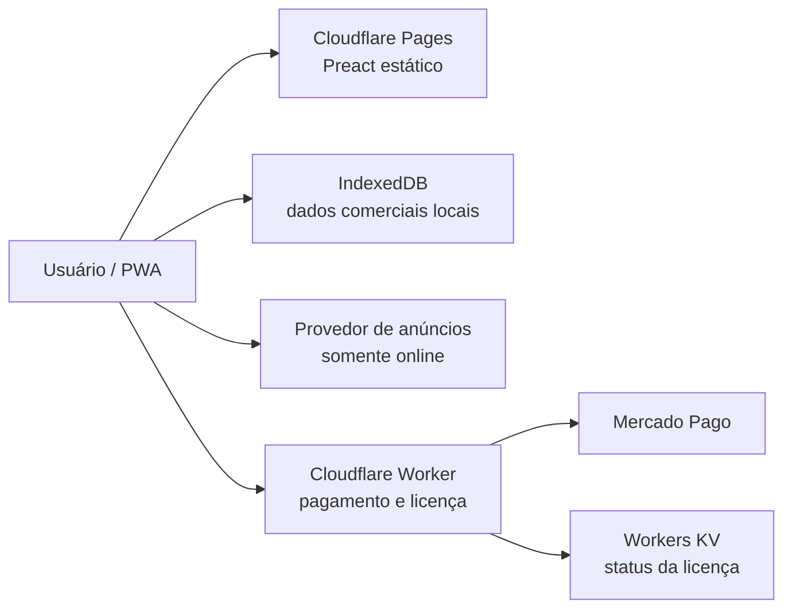

# ARQUITETURA — PDV DE BOLSO

## Objetivo

O PDV de Bolso é um PWA offline-first hospedado em `pdvdebolso.com`. O usuário
mantém controle integral dos dados do negócio, que permanecem no navegador.

## Mapa do sistema

## Responsabilidades

### Front-end

- Roda em `https://pdvdebolso.com`.
- Executa PDV, clientes, produtos e serviços, configurações, fiado, BI e backup
  no dispositivo.
- Mantém operação e cadastros separados: o PDV apenas vende; clientes, itens e
  preferências possuem módulos próprios.
- Continua funcional sem internet após a instalação e o primeiro carregamento.
- Nunca depende do Worker para registrar ou consultar operações do negócio.

### IndexedDB

- É a fonte de verdade para clientes, catálogo e transações.
- Usa Dexie para versionamento, índices, transações atômicas e migrações.
- Guarda valores monetários como inteiros em centavos.
- Mantém o livro financeiro imutável; correções geram novos lançamentos.

### Cloudflare Pages

- Entrega somente artefatos estáticos gerados pelo Vite.
- Recebe deploys do repositório GitHub.
- Usa `pdvdebolso.com` como origem canônica.
- Redireciona `www.pdvdebolso.com` para `pdvdebolso.com`.

### Cloudflare Worker

- Cria preferências de pagamento no Mercado Pago.
- Valida webhooks e confirma o pagamento na API do provedor.
- Emite ou disponibiliza a licença de remoção de anúncios.
- Usa Workers KV apenas para estado de pagamento/licença.
- Não recebe dados comerciais nem funciona como API do PDV.
- Expõe somente rotas versionadas em `/v1/licencas`, `/v1/webhooks` e
  `/v1/saude`.
- Define o preço da licença no servidor e exige idempotência na criação do
  checkout.
- Assina códigos restauráveis sem armazenar o segredo ou o código em texto
  aberto.

### Anúncios

- São opcionais para o funcionamento do produto.
- Só carregam quando há conexão e consentimento aplicável.
- Nunca ficam próximos de ações críticas do PDV.
- Desaparecem sem deixar espaço vazio quando offline ou licenciados.
- A integração deve ficar atrás de uma interface de provedor substituível.

## Limites arquiteturais

- Não criar servidor Node.js, Express, banco SQL ou API de sincronização.
- Não usar o Worker como proxy para dados locais.
- Não carregar bibliotecas de gráficos pesadas sem necessidade comprovada.
- Não alterar a origem de produção sem plano explícito de exportação/importação,
  pois IndexedDB é isolado por origem.

## Backup e propriedade dos dados

- Exportação e importação são executadas no dispositivo.
- O backup contém dados de domínio, versão do formato e licença restaurável.
- A aplicação lembra o usuário de exportar um backup a cada 14 dias.
- Deve solicitar armazenamento persistente quando suportado.
- Deve avisar que apagar os dados do site, trocar de aparelho ou mudar de origem
  pode eliminar o banco local se não houver backup.
- Backup criptografado por senha pode ser oferecido sem enviar a senha ou os
  dados para qualquer servidor.
